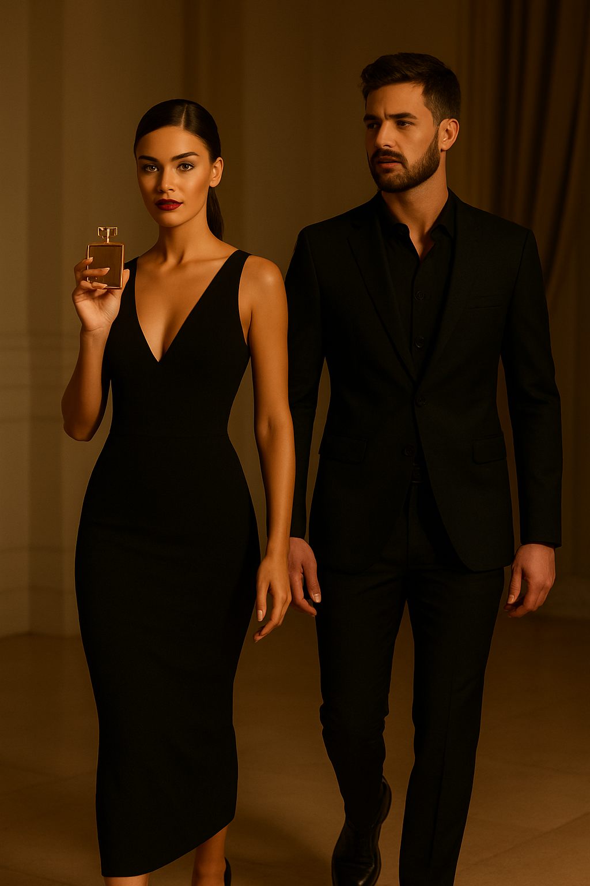
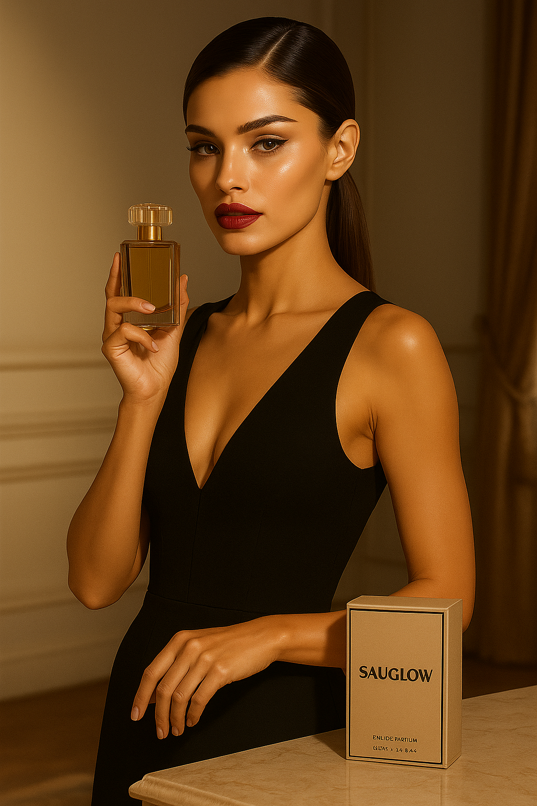
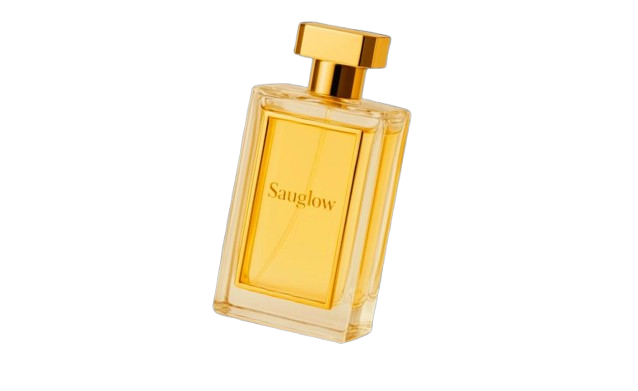
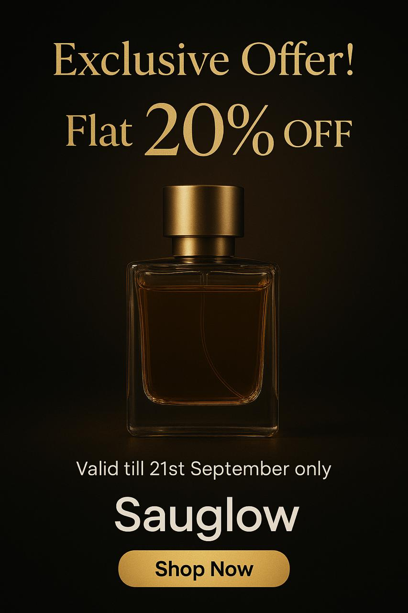
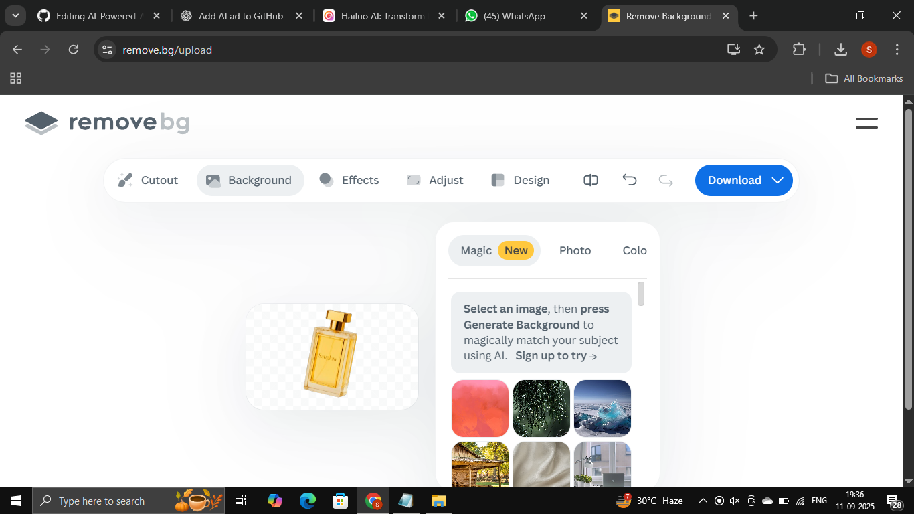
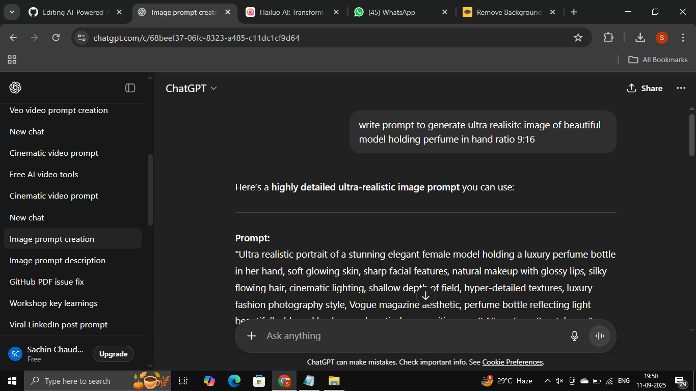
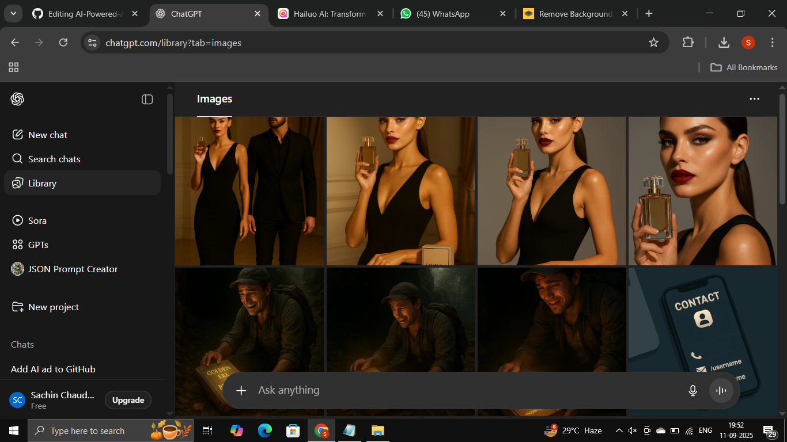
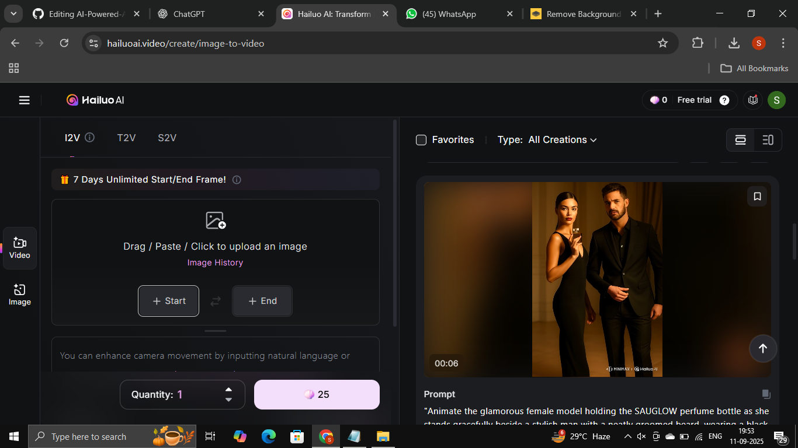
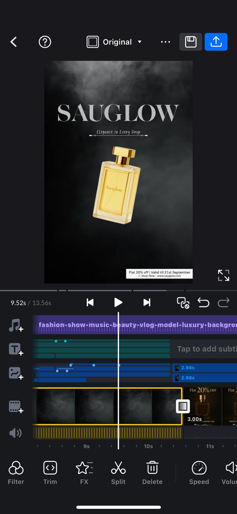

# AI-Powered-Ad-SAUGLOW-Perfume
This is a short cinematic AI-generated perfume ad for the brand SAUGLOW. The project demonstrates how I combined AI image generation, animation, and professional video editing to create branded ad content.

🎬 Project Workflow

1. Concept & Storyboarding

Scene 1 → Male & female model walk in, showing the perfume bottle. 
Scene 2 → Female model highlights the brand name SAUGLOW. 
Scene 3 → Close-up product shot with brand name & tagline. 
Scene 4 → Exclusive offer image (generated using JSON prompt). 

2. Image Generation

Tool Used: ChatGPT

Assets:

Image 1 → Model walking in with perfume (non-JSON prompt)
 
Image 2 → Female model showing brand name SAUGLOW (non-JSON prompt)

Image 3: Perfume bottle with brand name and tagline (AI generated with ChatGPT, background removed using remove.bg, text & overlays added during editing) 

 
Image 4 → Exclusive offer (generated using JSON prompt, prompt included below 👇)

<b>JSON Prompt </b> Used for Image 4:
{
  "prompt": "<<< {
  "ad_design": {
    "format": "9:16 vertical",
    "theme": "luxury, modern, elegant",
    "background": {
      "style": "dark gradient with subtle golden highlights",
      "mood": "premium, high-end"
    },
    "main_element": {
      "type": "product_image",
      "file_path": "/mnt/data/AB98A9E6-9DCE-4851-A939-DC99FF4BA4D7.jpeg",
      "placement": "center",
      "styling": "floating, softly illuminated, elegant focus"
    },
    "text_elements": [
      {
        "content": "Exclusive Offer!",
        "position": "top",
        "font_style": "bold, elegant serif",
        "size": "large",
        "color": "golden white"
      },
      {
        "content": "Flat 20% OFF",
        "position": "below_top",
        "font_style": "luxury, stylish modern",
        "size": "extra large",
        "color": "metallic gold"
      },
      {
        "content": "Valid till 21st September only",
        "position": "middle_bottom",
        "font_style": "clean, modern sans-serif",
        "size": "medium",
        "color": "soft white"
      }
    ],
    "brand_section": {
      "brand_name": "Sauglow",
      "position": "bottom",
      "font_style": "minimal, sleek",
      "size": "large",
      "color": "white"
    },
    "cta_button": {
      "text": "Shop Now",
      "position": "bottom_center",
      "style": {
        "shape": "rounded rectangle",
        "background_color": "gold gradient",
        "text_color": "black",
        "font_style": "bold modern sans-serif"
      }
    },
    "overall_style": "exclusive, refined, luxury advertisement"
  }
} >>>"
}

3. Animation

Used Hailuo AI to animate static images and create cinematic motion.

4. Editing & Post-Production

Edited with VN Video Editor:
Trimming & splitting 
Blending & transitions 
Keyframing 
Color grading 
Text & overlay design 
Background music from Pixabay (with fade in/out & volume control) 

🎨 Skills Highlighted:

Prompt Engineering 
AI Image-to-Video Storytelling 
Background Removal & Compositing (remove.bg) 
Video Editing & Post-Production 
Sound Design 
Branding & Creative Direction 

📽️ Final Output:

[🎥 Download Final Video](sauglowad.mp4)

🖼️ Behind the Scenes

Screenshots:
1. Background Remove

2. Prompting

3. Image Generated

4. Animation

5. VN Editing  
 

🔮 Future Work

Extend to multiple ad variations (luxury, festive, lifestyle). 
Experiment with different AI animation tools. 
Add voiceover or scripted narration. 
Test different aspect ratios (9:16, 1:1, 16:9) for social platforms. 

👤 Author

Sachin Chaudhary 
💼 [LinkedIn](https://www.linkedin.com/in/sachindecodes)  
📧 [sachinofficial1967@gmail.com](mailto:sachinofficial1967@gmail.com)  
🌐 [Portfolio](https://sachin-chaudhary-l2vbqho.gamma.site/)  

📜 License

This project is released under the MIT License. 
You are free to use, modify, and share it with attribution.
